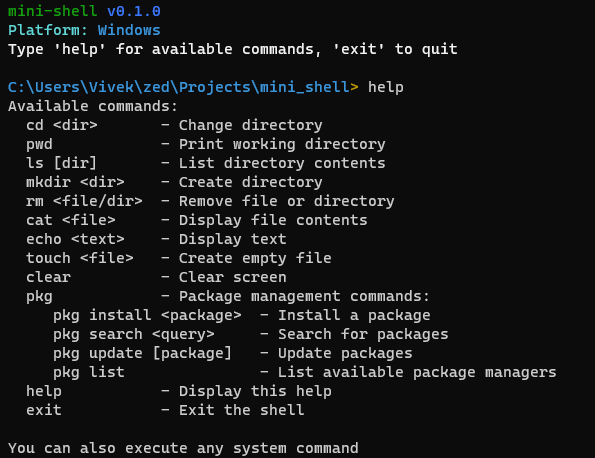

# Mini Shell

> [!NOTE]
> This project was created by me, as a learning exercise to explore and understand Rust, especially for building cross-platform CLI applications.

A cross-platform shell implementation written in Rust that provides basic file system operations and unified package management across different operating systems.


_Mini Shell running with package management_

## ✨ Features

- **Cross-Platform Support**: Works on Windows, macOS, and Linux
- **Core Shell Commands**: Familiar shell commands like `ls`, `cd`, `mkdir`, `rm`, `cat`, etc.
- **Unified Package Management**: Abstracts multiple package managers into a single interface
- **Smart Path Handling**: Supports absolute, relative, and `~` home directory paths
- **Colored Output**: Color-coded directory listings where supported
- **System Command Execution**: Run any system command directly

## 📋 Available Commands

| Command         | Description              | Example             |
| --------------- | ------------------------ | ------------------- |
| `cd <dir>`      | Change directory         | `cd ~/projects`     |
| `pwd`           | Print working directory  | `pwd`               |
| `ls [dir]`      | List directory contents  | `ls ~/documents`    |
| `mkdir <dir>`   | Create directory         | `mkdir new_folder`  |
| `rm <file/dir>` | Remove file or directory | `rm -rf old_folder` |
| `cat <file>`    | Display file contents    | `cat config.txt`    |
| `echo <text>`   | Display text             | `echo Hello World`  |
| `touch <file>`  | Create empty file        | `touch newfile.txt` |
| `clear`         | Clear screen             | `clear`             |
| `help`          | Display help information | `help`              |
| `exit`          | Exit the shell           | `exit`              |

## 🛠️ Package Management

Rust Shell provides a unified interface for package management across platforms:

```
pkg install <package>  - Install a package
pkg search <query>     - Search for packages
pkg update [package]   - Update packages
pkg list               - List available package managers
```

### Supported Package Managers

#### Windows

- Chocolatey (`choco`)
- WinGet
- Scoop

#### macOS

- Homebrew (`brew`)
- MacPorts

#### Linux

- APT
- DNF
- Pacman
- Zypper

#### Cross-Platform

- Snap
- Flatpak

## 🚀 Getting Started

### Prerequisites

- Rust and Cargo (latest stable version)

### Building from Source

1. Clone the repository:

   ```bash
   git clone https://github.com/itsvks19/mini-shell.git
   cd mini-shell
   ```

2. Build the project:

   ```bash
   cargo build --release
   ```

3. Run the shell:
   ```bash
   ./target/release/rust-shell
   ```

## 📦 Installation

### Cargo

```bash
cargo install mini-shell
```

## 🔧 Configuration

Mini Shell will detect available package managers on your system automatically. No additional configuration required!

## 🤝 Contributing

Contributions are welcome! Please feel free to submit a Pull Request.

1. Fork the repository
2. Create your feature branch (`git checkout -b feature/amazing-feature`)
3. Commit your changes (`git commit -m 'Add some amazing feature'`)
4. Push to the branch (`git push origin feature/amazing-feature`)
5. Open a Pull Request

## 📄 License

This project is licensed under the MIT License - see the LICENSE file for details.

## 🙏 Acknowledgments

- The Rust community for providing excellent libraries and documentation
- Unix and PowerShell for inspiration on shell design and functionality
